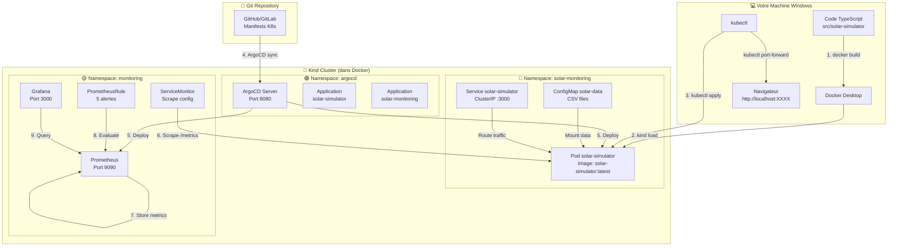

# 🏗️ Architecture Complète - Solar Monitoring GitOps

## 📦 Vue d'Ensemble - Les Couches



---

## 🔄 Flux de Déploiement Complet

### Étape 1 : Développement Local

```
┌─────────────────────────────────────┐
│  Votre Machine (Windows)            │
│                                     │
│  src/solar-simulator/               │
│  ├── src/                           │
│  │   ├── server.ts                  │
│  │   ├── services/                  │
│  │   └── types/                     │
│  ├── Dockerfile                     │
│  └── package.json                   │
└─────────────────────────────────────┘
         │
         │ npm install
         │ npm run build
         ▼
┌─────────────────────────────────────┐
│  Code TypeScript compilé            │
│  → JavaScript dans dist/            │
└─────────────────────────────────────┘
```

### Étape 2 : Containerisation

```
┌─────────────────────────────────────┐
│  Docker Desktop (Windows)           │
│                                     │
│  $ docker build -t solar-simulator  │
│                                     │
│  ┌─────────────────────────────┐   │
│  │ Image Docker                │   │
│  │ solar-simulator:latest      │   │
│  │ - Node.js 18 Alpine         │   │
│  │ - App compilée              │   │
│  │ - Size: ~134 MB             │   │
│  └─────────────────────────────┘   │
└─────────────────────────────────────┘
         │
         │ kind load docker-image
         ▼
```

### Étape 3 : Cluster Kubernetes (Kind)

```
┌──────────────────────────────────────────────────────────────┐
│  Kind Cluster "solar-montoring" (Container Docker)           │
│                                                              │
│  ┌────────────────────────────────────────────────────────┐ │
│  │  Namespace: solar-monitoring                           │ │
│  │                                                        │ │
│  │  ┌──────────────────┐    ┌──────────────────┐        │ │
│  │  │ ConfigMap        │───▶│ Pod              │        │ │
│  │  │ solar-data       │    │ solar-simulator  │        │ │
│  │  │                  │    │                  │        │ │
│  │  │ - provence.csv   │    │ Image: solar-... │        │ │
│  │  │ - occitanie.csv  │    │ Port: 3000       │        │ │
│  │  │ - aquitaine.csv  │    │ CPU: 100m-200m   │        │ │
│  │  └──────────────────┘    │ Mem: 128Mi-256Mi │        │ │
│  │                          │                  │        │ │
│  │                          │ Endpoints:       │        │ │
│  │  ┌──────────────────┐    │ /metrics         │        │ │
│  │  │ Service          │◀───│ /health          │        │ │
│  │  │ ClusterIP        │    │ /ready           │        │ │
│  │  │ Port: 3000       │    │ /info            │        │ │
│  │  └──────────────────┘    └──────────────────┘        │ │
│  └────────────────────────────────────────────────────────┘ │
│                                                              │
│  ┌────────────────────────────────────────────────────────┐ │
│  │  Namespace: monitoring                                 │ │
│  │                                                        │ │
│  │  ┌──────────────────┐    ┌──────────────────┐        │ │
│  │  │ ServiceMonitor   │───▶│ Prometheus       │        │ │
│  │  │                  │    │                  │        │ │
│  │  │ Selector:        │    │ Scrape every 30s │        │ │
│  │  │  app=solar-sim   │    │ Store metrics    │        │ │
│  │  │ Path: /metrics   │    │ Port: 9090       │        │ │
│  │  └──────────────────┘    └──────────────────┘        │ │
│  │                               ▲                       │ │
│  │  ┌──────────────────┐         │                       │ │
│  │  │ PrometheusRule   │─────────┘                       │ │
│  │  │                  │                                 │ │
│  │  │ 5 Alerting Rules:│         ┌──────────────────┐   │ │
│  │  │ - Overheating    │◀────────│ Grafana          │   │ │
│  │  │ - InverterDown   │         │                  │   │ │
│  │  │ - LowProduction  │         │ Dashboards       │   │ │
│  │  │ - DataLoss       │         │ Port: 3000       │   │ │
│  │  │ - SLOBreach      │         └──────────────────┘   │ │
│  │  └──────────────────┘                                 │ │
│  └────────────────────────────────────────────────────────┘ │
│                                                              │
│  ┌────────────────────────────────────────────────────────┐ │
│  │  Namespace: argocd                                     │ │
│  │                                                        │ │
│  │  ┌──────────────────┐    ┌──────────────────┐        │ │
│  │  │ ArgoCD Server    │◀───│ Git Repository   │        │ │
│  │  │                  │    │                  │        │ │
│  │  │ Port: 8080       │    │ k8s/apps/        │        │ │
│  │  │                  │    │ k8s/monitoring/  │        │ │
│  │  │ Applications:    │    │ k8s/argocd/      │        │ │
│  │  │ - solar-sim      │    └──────────────────┘        │ │
│  │  │ - monitoring     │                                 │ │
│  │  └──────────────────┘                                 │ │
│  └────────────────────────────────────────────────────────┘ │
└──────────────────────────────────────────────────────────────┘
```

---

## 🔌 Accès depuis votre Machine

```
┌────────────────────────────────────────────────────────────┐
│  Votre Navigateur (Windows)                                │
│                                                            │
│  http://localhost:3000  ──┐                               │
│  http://localhost:9090  ──┤                               │
│  http://localhost:8080  ──┘                               │
└────────────────────────────────────────────────────────────┘
                │
                │ kubectl port-forward
                ▼
┌────────────────────────────────────────────────────────────┐
│  Kind Cluster                                              │
│                                                            │
│  Port 3000 → solar-simulator pod                          │
│  Port 9090 → prometheus service                           │
│  Port 8080 → argocd-server service                        │
└────────────────────────────────────────────────────────────┘
```

---

## 📊 Flux de Monitoring

```
1. Application expose métriques
   Pod solar-simulator
   └─▶ GET /metrics
       └─▶ solar_power_production_kw{farm="provence"} 245.8
           solar_panel_temperature_celsius{farm="provence"} 42.3
           ...

2. ServiceMonitor configure Prometheus
   ServiceMonitor (monitoring namespace)
   └─▶ Scrape pod solar-simulator every 30s
       └─▶ Namespace: solar-monitoring
           Labels: app=solar-simulator
           Path: /metrics

3. Prometheus collecte et stocke
   Prometheus
   └─▶ Scrape /metrics
   └─▶ Store in TSDB
   └─▶ Evaluate rules every 30s

4. PrometheusRule déclenche alertes
   PrometheusRule
   └─▶ IF solar_panel_temperature_celsius > 65 FOR 10m
       └─▶ ALERT SolarPanelOverheating
           └─▶ Severity: critical

5. Grafana visualise
   Grafana
   └─▶ Query Prometheus
   └─▶ Display Dashboard
       └─▶ 6 panels with real-time data
```

---

## 🚀 Workflow GitOps avec ArgoCD

```
┌──────────────┐
│ Developer    │
│ (Vous)       │
└──────┬───────┘
       │
       │ 1. Modifier k8s/apps/deployment.yaml
       │ 2. git commit & push
       ▼
┌──────────────────────┐
│ Git Repository       │
│ (GitHub/GitLab)      │
└──────┬───────────────┘
       │
       │ 3. ArgoCD poll repository
       ▼
┌──────────────────────┐
│ ArgoCD Server        │
│ (argocd namespace)   │
└──────┬───────────────┘
       │
       │ 4. Detect changes
       │ 5. kubectl apply
       ▼
┌──────────────────────┐
│ Kubernetes Cluster   │
│ (Kind)               │
│                      │
│ ✅ Auto-deploiement  │
│ ✅ Auto-heal         │
│ ✅ Sync status       │
└──────────────────────┘
```

---

## 🎯 Rôle de Chaque Composant

### Docker Desktop
- **Rôle** : Environment de containerisation
- **Fait** : Build les images, run Kind cluster
- **Commandes** : `docker build`, `docker ps`

### Kind
- **Rôle** : Cluster Kubernetes local
- **Fait** : Simule un vrai cluster K8s dans Docker
- **Commandes** : `kind create cluster`, `kind load docker-image`

### Pod solar-simulator
- **Rôle** : Application Node.js/TypeScript
- **Fait** : Expose métriques Prometheus
- **Endpoints** : `/metrics`, `/health`, `/ready`, `/info`

### Service
- **Rôle** : Point d'entrée stable vers les pods
- **Fait** : Load balancing, DNS interne
- **Type** : ClusterIP (interne au cluster)

### ConfigMap
- **Rôle** : Stockage configuration/données
- **Fait** : Monte les 3 fichiers CSV dans le pod
- **Contenu** : provence_data.csv, occitanie_data.csv, aquitaine_data.csv

### Prometheus
- **Rôle** : Base de données time-series
- **Fait** : Scrape metrics, stocke, évalue rules
- **Config** : ServiceMonitor (quoi scraper)

### ServiceMonitor
- **Rôle** : Configuration de scraping pour Prometheus Operator
- **Fait** : Dit à Prometheus comment trouver et scraper l'app
- **Config** : Interval 30s, path /metrics

### PrometheusRule
- **Rôle** : Règles d'alerting
- **Fait** : Évalue conditions, déclenche alertes
- **Contenu** : 5 rules (overheating, inverter down, etc.)

### Grafana
- **Rôle** : Visualisation de métriques
- **Fait** : Dashboards interactifs
- **Source** : Query Prometheus

### ArgoCD
- **Rôle** : GitOps - Continuous Deployment
- **Fait** : Sync Git → Kubernetes automatiquement
- **Applications** : solar-simulator, solar-monitoring

---

## 🔐 Namespaces et Isolation

```
┌─────────────────────────────────────┐
│ Cluster Kind                        │
│                                     │
│ ┌─────────────────────────────────┐ │
│ │ solar-monitoring (App)          │ │
│ │ - Pod solar-simulator           │ │
│ │ - Service solar-simulator       │ │
│ │ - ConfigMap solar-data          │ │
│ └─────────────────────────────────┘ │
│                                     │
│ ┌─────────────────────────────────┐ │
│ │ monitoring (Observabilité)      │ │
│ │ - Prometheus                    │ │
│ │ - Grafana                       │ │
│ │ - ServiceMonitor                │ │
│ │ - PrometheusRule                │ │
│ └─────────────────────────────────┘ │
│                                     │
│ ┌─────────────────────────────────┐ │
│ │ argocd (GitOps)                 │ │
│ │ - ArgoCD Server                 │ │
│ │ - Application CRDs              │ │
│ └─────────────────────────────────┘ │
│                                     │
│ ┌─────────────────────────────────┐ │
│ │ default (Vide)                  │ │
│ └─────────────────────────────────┘ │
└─────────────────────────────────────┘
```

---

## ✅ Résumé - Ce que vous avez construit

1. **Application TypeScript** qui lit des CSV et expose des métriques
2. **Image Docker** optimisée (134 MB) avec multi-stage build
3. **Cluster Kubernetes** local avec Kind
4. **Déploiement K8s** avec ConfigMap pour les données
5. **Monitoring Prometheus** avec scraping automatique
6. **5 Règles d'alerting** pour détecter les anomalies
7. **Grafana** pour visualiser (à configurer)
8. **ArgoCD** pour le GitOps (à connecter au Git)

**Félicitations !** Vous avez une stack complète de monitoring GitOps ! 🎉
